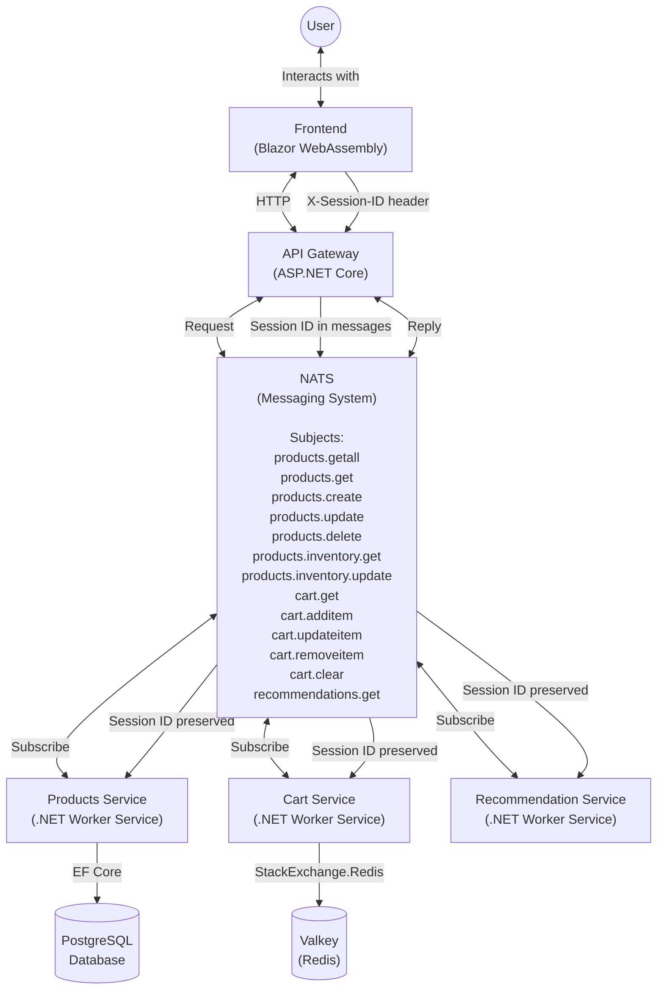

# NATS Shop

A modern microservice based webshop application built with .NET, Blazor WebAssembly, and NATS messaging. All for fun

## Communication Flow



The communication flow works as follows:

1. **User Interaction**: The user interacts with the Blazor WebAssembly frontend
2. **API Request**: The frontend makes HTTP requests to the Gateway API
3. **Session Tracking**: Each request includes a session ID (X-Session-ID header) for tracking
4. **Message Publishing**: The Gateway publishes messages to NATS with appropriate subjects
5. **Service Processing**: The Products, Cart, and Recommendation services consume messages and process them
6. **Database Operations**:
   - The Products service performs operations on PostgreSQL database
   - The Cart service stores session-based cart data in Valkey (Redis) with 15-minute TTL
   - The Recommendation service provides product recommendations based on cart contents
7. **Response**: Results are sent back through NATS to the Gateway and then to the frontend

## Running the Application

The easiest way to run the entire application stack is with Docker Compose:

```bash
docker-compose up
```

This will start:
- The frontend on http://localhost:8081
- The Gateway API on http://localhost:8080
- The Products service
- The Cart service
- The Recommendation service
- NATS messaging system
- PostgreSQL database
- Valkey (Redis) database

The Products service will automatically run database migrations and seed the database with sample data.


### Session Management

The application implements cross-service session tracking:

- **Browser Storage**: Frontend stores session IDs in local storage
- **Request Headers**: Session IDs are included in all API requests via the `X-Session-ID` header
- **Middleware**: Gateway adds session IDs to requests if not present
- **Message Propagation**: Session IDs are included in NATS messages
- **Response Headers**: Session IDs are returned in response headers

### Messaging with NATS

NATS is used for service-to-service communication:

- **Request/Reply Pattern**: Used for synchronous operations
- **Message Serialization**: JSON serialization for messages
- **Connection Resilience**: Automatic reconnection and retry logic
- **Message Routing**: Subject-based routing for different operations

### API Endpoints

#### Health and Readiness

- `GET http://localhost:8080/healthz`: Health check endpoint
- `GET http://localhost:8080/readinessz`: Readiness check endpoint

#### Products

- `GET http://localhost:8080/api/products`: Get paginated products
- `GET http://localhost:8080/api/products/{id}`: Get a product by ID
- `POST http://localhost:8080/api/products`: Create a new product
- `PUT http://localhost:8080/api/products/{id}`: Update a product
- `DELETE http://localhost:8080/api/products/{id}`: Delete a product

#### Inventory

- `GET http://localhost:8080/api/products/{id}/inventory`: Get inventory status
- `PUT http://localhost:8080/api/products/{id}/inventory`: Update inventory

## Configuration

### Environment Variables

#### Gateway Service
- `NATS_URL`: The URL of the NATS server (default: `nats://localhost:4222`)
- `ASPNETCORE_URLS`: The URLs to listen on (default: `http://0.0.0.0:8080`)
- `ASPNETCORE_ENVIRONMENT`: The environment (Development, Staging, Production)

#### Products Service
- `NATS_URL`: The URL of the NATS server (default: `nats://localhost:4222`)
- `DB_CONNECTION_STRING`: The PostgreSQL connection string (default: `Host=localhost;Database=products;Username=postgres;Password=postgres`)

#### Cart Service
- `NATS_URL`: The URL of the NATS server (default: `nats://localhost:4222`)
- `REDIS_CONNECTION_STRING`: The Valkey/Redis connection string (default: `localhost:6379`)

#### Recommendation Service
- `NATS_URL`: The URL of the NATS server (default: `nats://localhost:4222`)

#### Frontend
- `ApiBaseUrl`: Configured in appsettings.json or can be overridden with JavaScript
